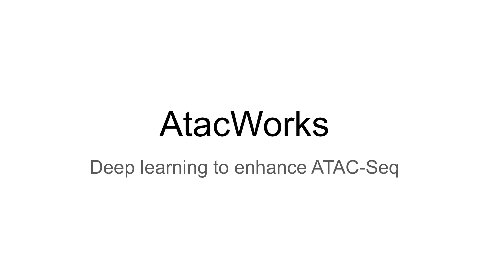

# AtacWorks

AtacWorks is a deep learning toolkit for coverage track denoising and peak calling from low-coverage or low-quality ATAC-Seq data.



## Installation

### System requirements

* Ubuntu 16.04+
* CUDA 9.0+
* Python 3.6.7+
* GCC 5+
* (Optional) A conda or virtualenv setup
* Any NVIDIA GPU that supports CUDA 9.0+

**AtacWorks training and inference currently does not run on CPU.**

### PyPI installation
To install atacworks in your environment, run the following in your terminal
```
pip install atacworks==0.3.0
```

### Docker Installation
If you'd like to skip all installation and use a pre-installed docker image instead,
follow the instructions [here](Dockerfile.md), section "Pre-installed AtacWorks".

If you'd like to pull a docker image that contains AtacWorks source code, then 
follow the instructions [here](Dockerfile.md), section "AtacWorks from Source".

## Build from Source
Follow the instructions below if you are interested in running AtacWorks tutorial notebooks outside
of docker.

### 1. Clone repository

#### Latest released version
This will clone the repo to the `master` branch, which contains code for latest released version
and hot-fixes.

```
git clone --recursive -b master https://github.com/clara-genomics/AtacWorks.git
```
#### Latest development version
This will clone the repo to the default branch, which is set to be the latest development branch.
This branch is subject to change frequently as features and bug fixes are pushed.

```
git clone --recursive https://github.com/clara-genomics/AtacWorks.git
```

### 2. Install dependencies

* Download `bedGraphToBigWig` and `bigWigToBedGraph` binaries and add $PATH to your bashrc.
    ```
    rsync -aP rsync://hgdownload.soe.ucsc.edu/genome/admin/exe/linux.x86_64/bedGraphToBigWig <custom_path>
    rsync -aP rsync://hgdownload.soe.ucsc.edu/genome/admin/exe/linux.x86_64/bigWigToBedGraph <custom_path>
    export PATH="$PATH:<custom_path> >> ~/.bashrc"
    ```

* Install pip dependencies

    ```
    cd AtacWorks && pip install -r requirements.txt
    ```
* Optional -- Install macs2.
  Only required if you want to use macs2 subcommands to call peaks based on peak probabilities generated by AtacWorks.

    ```
    pip install macs2==2.2.4
    ```

* Install atacworks

    ```
    pip install .
    ```

 
### 3. Tests

Run unit tests to verify that installation was successful

    ```
    python -m pytest tests/
    ```

## Workflow
AtacWorks trains a deep neural network to learn a mapping between noisy (low coverage/low cell count/low quality) ATAC-seq data and matching clean (high coverage, high cell count, and/or high quality) ATAC-seq data. Both noisy and clean data should be from the same cell type or tissue. Once this mapping is learned, the trained model can be applied to improve other noisy ATAC-Seq datasets.

### 1. Training an AtacWorks model

See [Tutorial 1](tutorials/tutorial1.md) for a workflow detailing the steps of model training and how to modify the parameters used in these steps.

### 2. Denoising and peak calling using a trained AtacWorks model

See [Tutorial 2](tutorials/tutorial2.md) for an advanced workflow detailing the prediction using a trained model, and how to modify the parameters used in these steps. 

## FAQ
1. What's the preferred way for setting up the environment?
    > A virtual environment, conda installation or docker is preferred for running atacworks. Follow the instructions of setting up your preferred platforms. Once the env is setup, you can follow the Installation section above to install all the necessary dependencies.


## Contributing to AtacWorks
This section is only for developers of atacworks. If you would like to contribute to atacworks codebase,
take a look at the development guidelines [here](https://clara-parabricks.github.io/development.html#contributing-to-clara-omics).
You can read about our Continuous Integration (CI) test flow [here](https://clara-parabricks.github.io/development.html#ci-testing).

### Running CI Tests Locally
When a PR is submitted to the github, CI tests are triggered by github CI. If you would like to run those tests locally,
follow the instructions below.
!!CAUTION!!
Please note, your git repository will be mounted to the container, any untracked files will be removed from it.
Before executing the CI locally, stash or add them to the index.

Requirements:
1. [docker](https://docs.docker.com/install/linux/docker-ce/ubuntu/)
2. [nvidia-docker](https://github.com/NVIDIA/nvidia-docker)
3. [nvidia-container-runtime](https://github.com/NVIDIA/nvidia-container-runtime)

Run the following command to execute the CI build steps inside a container locally:

```
bash ci/local/build.sh -r <Atacworks repo path>
```
ci/local/build.sh script was adapted from [rapidsai/cudf](https://github.com/rapidsai/cudf/tree/branch-0.11/ci/local)
The default docker image is **clara-genomics-base:cuda10.1-ubuntu16.04-gcc5-py3.6**.

Other images from [gpuci/clara-genomics-base](https://hub.docker.com/r/gpuci/clara-genomics-base/tags) repository can be used instead, by using -i argument as shown below:

```
bash ci/local/build.sh -r <Atacworks repo path> -i gpuci/clara-genomics-base:cuda10.0-ubuntu18.04-gcc7-py3.6
```

## Citation

Please cite AtacWorks as follows:

Lal, A., Chiang, Z.D., Yakovenko, N., Duarte, F.M., Israeli, J. and Buenrostro, J.D., 2019. AtacWorks: A deep convolutional neural network toolkit for epigenomics. BioRxiv, p.829481.

Link: [https://www.biorxiv.org/content/10.1101/829481v2](https://www.biorxiv.org/content/10.1101/829481v2)
