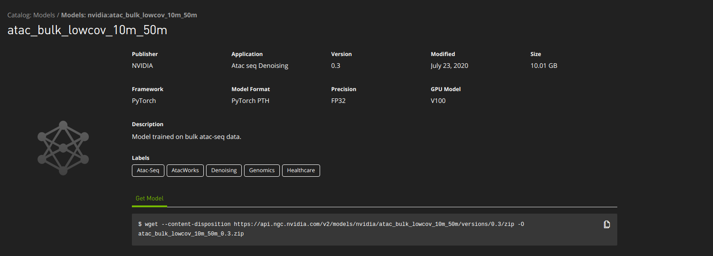
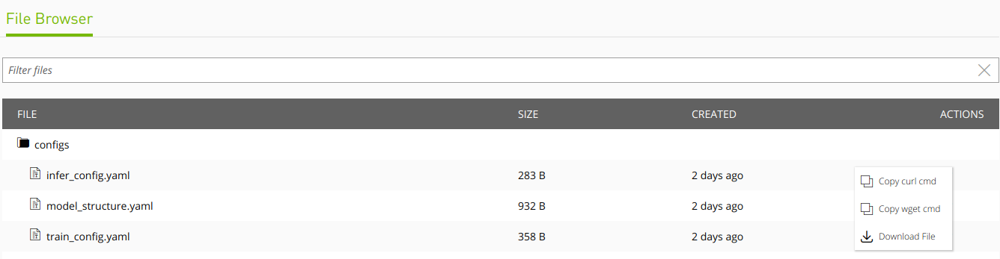

Pretrained_models
=================

This is a list of AtacWorks denoising models that were reported in Lal & Chiang, 2019. 
Models were trained to denoise bulk or single-cell ATAC-seq data of varying sequencing depths.

Note that all the AtacWorks models described in here are available to `download <https://ngc.nvidia.com/catalog/models>`_.

To download a model and it's corresponding data, search for the name at "Model path" column in the NGC model catalog. You can find a wget command at the bottom of the description box of the model as shown in the screenshot below.

To view all the files, click on the `File Browser` tab. You can download individual files by clicking on a subfloder then clicking on the three dots alongside the file you would like to download.

The training data for these models was generated from BAM files using `this script <https://github.com/zchiang/atacworks_analysis/blob/master/preprocessing/atac_bam2bw.sh>`_. 

Briefly, each ATAC-seq read was converted to a single genomic position corresponding to the first base pair of the read. Reads aligning to the + strand were offset by +4 bp, while reads aligning to the - strand were offset by -5 bp. Each cut site location was extended by 100 bp in either direction. The bedtools genomecov function was used to convert the list of locations into a coverage track. To call peaks from clean and noisy signal tracks, MACS2 subcommands bdgcmp and bdgpeakcall were run with the ppois parameter and a -log10(p-value) cutoff of 3. BED files with equal coverage over all chromosomes were provided as a control input track.

Before using these models, please note that they should only be used on data that is processed exactly as described above. If your bigWig files and/or peak calls are generated using a different method, these models may give unreliable results, and it would be preferable to train your own model as described in Tutorial 1. 

+------------+---------------+-----------+-----------+-----------+-----------+------------+----------------------+-------------------+-------------------------------------------------+
|Data type   |Noise type     |Noisy data |Clean data |Noisy data |Clean data |Single-cell |Training cell type(s) |Interval size (bp) |Model path                                       |
|            |               |depth      |depth      |cell count |cell count |protocol    |                      |                   |                                                 |
+============+===============+===========+===========+===========+===========+============+======================+===================+=================================================+
|Bulk        |Low coverage   |0.2M       |50M        |N/A        |N/A	     |N/A         |CD4, CD8, B, NK       |50,000             |atac_bulk_lowcov_0_2m_50m                        |
+------------+---------------+-----------+-----------+-----------+-----------+------------+----------------------+-------------------+-------------------------------------------------+
|Bulk	     |Low coverage   |1M         |50M        |N/A        |N/A	     |N/A         |CD4, CD8, B, NK       |50,000             |atac_bulk_lowcov_1m_50m                          |
+------------+---------------+-----------+-----------+-----------+-----------+------------+----------------------+-------------------+-------------------------------------------------+
|Bulk        |Low coverage   |5M         |50M        |N/A        |N/A	     |N/A         |CD4, CD8, B, NK       |50,000             |atac_bulk_lowcov_5m_50m                          |
+------------+---------------+-----------+-----------+-----------+-----------+------------+----------------------+-------------------+-------------------------------------------------+
|Bulk        |Low coverage   |10M        |50M        |N/A        |N/A	     |N/A         |CD4, CD8, B, NK       |50,000             |atac_bulk_lowcov_10m_50m                         |
+------------+---------------+-----------+-----------+-----------+-----------+------------+----------------------+-------------------+-------------------------------------------------+
|Bulk        |Low coverage   |20M        |50M        |N/A        |N/A	     |N/A         |CD4, CD8, B, NK       |50,000             |atac_bulk_lowcov_20m_50m                         |
+------------+---------------+-----------+-----------+-----------+-----------+------------+----------------------+-------------------+-------------------------------------------------+
|Bulk        |Low quality    |20M        |20M        |N/A        |N/A	     |N/A         |Monocytes             |50,000             |atac_bulk_lowqual_20m_20m                        |
+------------+---------------+-----------+-----------+-----------+-----------+------------+----------------------+-------------------+-------------------------------------------------+
|Single-cell |Low cell count |~0.2M      |~13M       |90         |6000	     |dsci-ATAC   |CD4, CD8, preB        |50,000             |atac_dsci_atac_lowcellcount_0_2m_13m_90_6000     |
+------------+---------------+-----------+-----------+-----------+-----------+------------+----------------------+-------------------+-------------------------------------------------+
|Single-cell |Low cell count |~1M        |~13M       |450        |6000	     |dsci-ATAC   |CD4, CD8, preB        |50,000             |atac_dsci_atac_lowcellcount_1m_13m_450_6000      |
+------------+---------------+-----------+-----------+-----------+-----------+------------+----------------------+-------------------+-------------------------------------------------+
|Single-cell |Low cell count |~0.2M      |~48M       |10         |2400	     |dsc-ATAC    |B, Monocytes          |50,000             |atac_dsci_atac_lowcellcount_0_2m_48m_10_2400     |
+------------+---------------+-----------+-----------+-----------+-----------+------------+----------------------+-------------------+-------------------------------------------------+
|Single-cell |Low cell count |~1M        |~48M       |50         |2400	     |dsc-ATAC    |B, Monocytes          |50,000             |atac_dsci_atac_lowcellcount_1m_48m_50_2400       |
+------------+---------------+-----------+-----------+-----------+-----------+------------+----------------------+-------------------+-------------------------------------------------+

