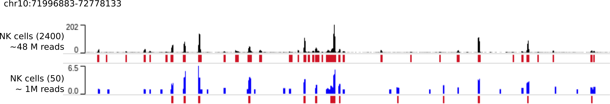

# Denoising and peak calling using a trained AtacWorks model 

## Introduction

In this tutorial we use a pre-trained AtacWorks model to denoise and call peaks from low-coverage aggregate single-cell ATAC-seq data. We use the dsc-ATAC-seq dataset presented in reference (1), section "AtacWorks generalizes to diverse applications". This dataset consists of single-cell ATAC-seq data from several types of human blood cells.

We selected 2400 NK cells from this dataset - this is our ‘clean’, high-coverage dataset. We then randomly sampled 50 of these 2400 NK cells. Here's what the ATAC-seq signal from 50 cells and 2400 cells looks like, for a region on chromosome 10:

Compared to the 'clean' signal from 2400 cells, the aggregated ATAC-seq profile of these 50 cells is noisy. Because the signal is noisy, peak calls calculated by MACS2 on this data (shown as red bars below the signal tracks) are also inaccurate. The AUPRC of peak calling by MACS2 on the noisy data is only 0.20.

As reported in our paper, we trained an AtacWorks model to learn a mapping from 50-cell signal to 2400-cell signals and peak calls. In other words, given a noisy ATAC-seq signal from 50 cells, this model learned what the signal would look like - and where the peaks would be called - if we had sequenced 2400 cells. This model was trained on data from Monocytes and B cells, so it has not encountered data from NK cells.

If you want to train your own AtacWorks model instead of using the model reported in the paper, refer to [Tutorial 1](tutorial1.md).

## Downloading pre-trained models

All models described in [Lal & Chiang, et al. (2019)](https://www.biorxiv.org/content/10.1101/829481v2) are available for download and use at `https://atacworks-paper.s3.us-east-2.amazonaws.com`. 

See [pre-trained denoising models](pretrained_models) for a list of the available pre-trained denoising models.

Before using one of these models, please consider the following:

1. Please read the description of how the training datasets for these models were preprocessed, in Lal & Chiang, et al. (2019), Methods section, paragraph 1. If your data processing pipeline is different, it is advisable to train a new model using the instructions in [tutorial 1](tutorial1.md).

2. AtacWorks models should only be applied to data of similar sequencing depth as the data used to train the model. If the sequencing depth of your dataset is different from that used for our pre-trained models, it is also advisable to train a new model using the instructions in [Tutorial 1](tutorial1.md).

See below for instructions to use our pre-trained models or your own trained models.

## Input files

To denoise and call peaks from low-coverage, low cell count, or low quality ATAC-seq data, you need three input files:

1. A trained AtacWorks model file with extension `.pth.tar`.

2. A coverage track representing the number of sequencing reads mapped to each position on the genome in the low-coverage or low-quality dataset. This track should be processed in the same way as the files used for training the model. Format: [bigWig](https://genome.ucsc.edu/goldenPath/help/bigWig.html)

3. Chromosome sizes file - a tab-separated text file containing the names and sizes of chromosomes in the genome.

## Tutorial Notebook

For easy demonstration of the inference workflow, we've set up a notebook that breaks the above command down into it's component parts and familiarizes users with each step and all of the options available. Click here to access the [notebook](https://github.com/clara-parabricks/AtacWorks/blob/dev-v0.3.0/tutorials/tutorial2.ipynb).
